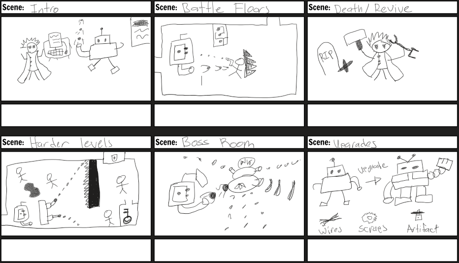

# The Forgotten

## Table of contents

* [Overview](#overview)
* [Gameplay](#gameplay)
* [User Guide](#user-guide)
* [Storyboard](#storyboard)
* [Team](#team)

## Overview

The Forgotten is a 2D top down roguelike game following the story of an android built by a surviving scientist. It takes place in the forgotten laboratory years after the "accident." Fight your way through this laboratory to reclaim the lost technologies within the facility. 

## Gameplay

The Forgotten is a roguelike where you battle rogue machines and savage animals to reclaim the lost technology. The user is able to pick up permanent power ups as you fight bosses without getting hit. However, there are temporary power ups that you can pick up. Weapons can be upgraded based on the floor and general stat upgrades or shot patterns can be changed. Throughout your journey within the facility, you will encounter a few people, namely the Shopkeeper, and the Genius Guy. The shopkeeper will sell items to you regardless of the quality of his items. The genius guy is your creator. Whenever you find yourself defeated within the facility, he will come and rebuild you. You must find his item no matter what. 

## User Guide

Movement - Movement is done by using the WASD keys and will move you up, left, down, and right respectively. 

### Storyboard

## Team

The Forgotten is designed, implemented, and maintained by Cyber Realms. Cyber Realms is made up of 4 members, Jackie, Sola, Kevin, and Alex. 
